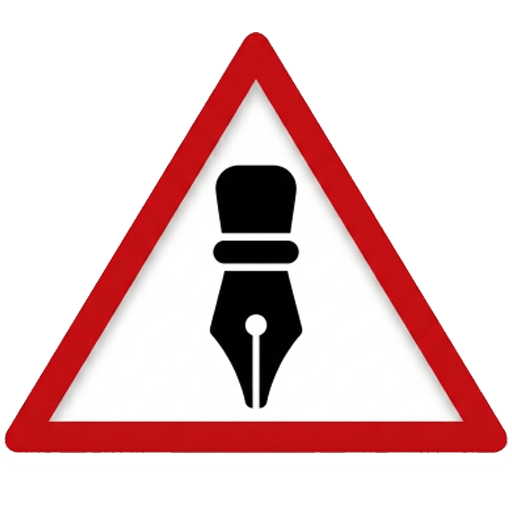
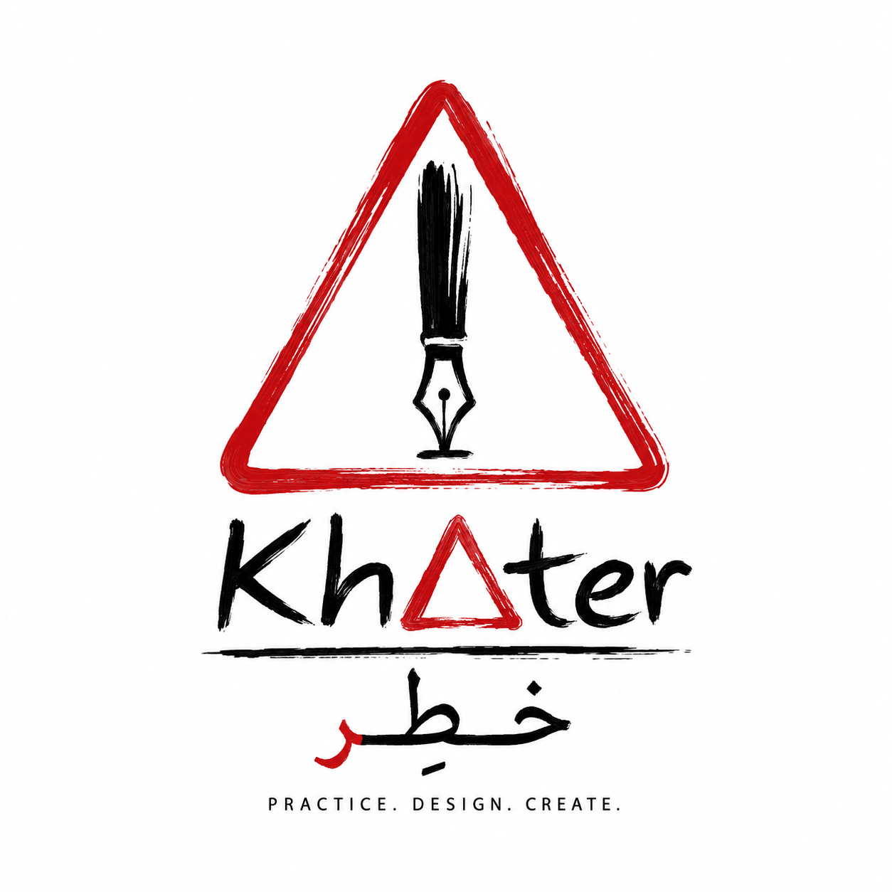
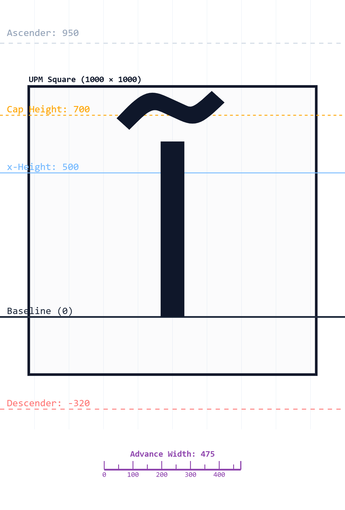
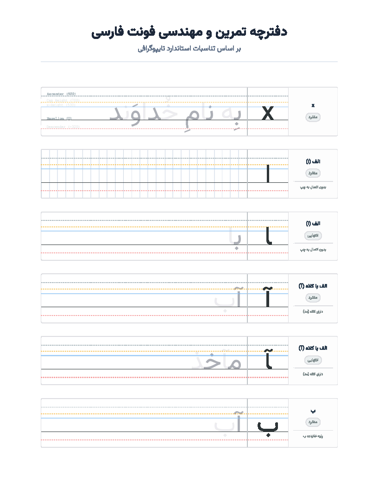

  
  <h1>خط‌ِر (KhAter)</h1>
  
<b>دفترچه مهندسی و آنالیز دقیق فونت فارسی</b>

  
ابزاری ساخته شده برای دقت در تایپ‌دیزاین

---

## 📖 درباره پروژه
**خط‌ِر (KhAter)** یک پلتفرم و ابزار تحت وب جامع برای طراحان تایپ (Type Designers) است. با این ابزار می‌توانید متریک‌های فونت را با دقت ریاضی تنظیم کنید، فواصل (Kerning) را زنده بررسی کنید و برای طراحی اسکلت حروف، خروجی‌های استاندارد و مهندسی شده استخراج نمایید. هدف از توسعه‌ی این ابزار، ارتقای سطح مهندسی تایپ‌فیس‌های فارسی و کمک به خلق فونت‌های خواناتر و زیباتر است.

## ✨ امکانات کلیدی

*   **📏 کنترل کامل متریک‌ها:** وارد کردن مقادیر `UPM`، `Ascender`، `Cap Height`، `x-Height` و `Descender` به صورت دستی یا استخراج خودکار آن‌ها مستقیماً از فایل فونت.
*   **🔍 آنالیز Kerning و Advance Width:** بهره‌گیری از موتور قدرتمند `OpenType.js` برای مشاهده دقیق فضای اشغالی هر حرف و فواصل تعبیه‌شده (Kerning) به‌صورت بصری و عددی.
*   **🖨️ خروجی‌های مهندسی‌شده:** تولید فایل‌های `SVG` و `PNG` با رزولوشن منطبق بر UPM برای طراحی دقیق گلیف‌ها، و همچنین دریافت فایل‌های `PDF` چند صفحه‌ای جهت چاپ.
*   **📊 مدیریت داده‌ها با اکسل:** قابلیت ورود و خروج لیست کاراکترها، دسته‌بندی‌ها، نمونه متون و فرم‌های مختلف حروف از طریق فایل‌های Excel.
*   **🎨 تفکیک رنگی متون تمرین:** رندر خودکار حروف زوج و فرد در نمونه‌متن‌ها با رنگ‌ها و شفافیت‌های متفاوت برای درک بهتر مرز اتصال حروف فارسی/عربی.
*   **⚡ کاملاً تحت وب و امن:** تمام پردازش‌ها (از جمله رندر فونت‌های سفارشی و خواندن اکسل) بدون نیاز به نصب نرم‌افزار، درون مرورگر شما و با امنیت کامل انجام می‌شود.

## 🛠️ خروجی‌های استاندارد برای تایپ‌دیزاینرها
این ابزار خروجی‌های زیر را به شکلی کاملاً بهینه برای طراحان فراهم می‌کند:
- **PDFهای خط‌کشی شده:** شامل خطوط پنج‌گانه راهنما با ضخامت و رنگ متفاوت جهت تمرین کالیگرافی و طراحی دستی روی کاغذ.
- **SVGهای مهندسی شده:** کاملاً آماده برای ایمپورت مستقیم در نرم‌افزارهای تخصصی طراحی فونت نظیر *Glyphs*, *FontForge* و *FontLab*.
- **آنالیز فرم‌ها:** نمایش اطلاعات تخصصی هر گلیف، حالت‌ها (منفرد، انتهایی و...) و استایل‌های متصل.

## 🚀 نحوه استفاده
پروژه کاملاً Client-side است. 
1. فایل‌های پروژه را کلون یا دانلود کنید.
2. برای مشاهده لندینگ‌پیج، فایل `index.html` را در مرورگر باز کنید.
3. برای استفاده از محیط اصلی نرم‌افزار، وارد `app.html` شوید.
*هیچ نیازی به سرور، دیتابیس یا نصب پکیج خاصی نیست!*

## 💻 تکنولوژی‌های استفاده شده
- **رابط کاربری:** HTML5, CSS3, [Tailwind CSS](https://tailwindcss.com/)
- **جاوااسکریپت:** Vanilla JS
- **پردازش فونت:** [OpenType.js](https://opentype.js.org/)
- **تایپوگرافی:** فونت [وزیرمتن (Vazirmatn)](https://github.com/rastikerdar/vazirmatn)

## 🖼️ تصاویر محیط برنامه
*(تصاویر مربوطه در پوشه `./img/` قرار دارند)*

| کانسپت پروژه | نمونه خروجی گلیف (SVG) | نمونه خروجی تمرین (PDF) |
| :---: | :---: | :---: |
|  |  |  |

## 📄 لایسنس
این پروژه از رویکرد تفکیک لایسنس (Dual Licensing) استفاده می‌کند:
* **سورس کدها:** تحت لایسنس متن‌باز **[MIT License](https://opensource.org/licenses/MIT)** منتشر شده‌اند. استفاده، تغییر و توزیع کدها برای همگان آزاد است.
* **خروجی‌های برنامه و محتوا:** فایل‌های تولید شده توسط این برنامه (شامل خروجی‌های PDF و SVG) و همچنین محتوای گرافیکی پروژه، تحت لایسنس **[CC BY-NC 4.0](https://creativecommons.org/licenses/by-nc/4.0/)** قرار دارند و استفاده از آن‌ها صرفاً برای مقاصد **غیرتجاری** مجاز است.

## 📞 تماس با توسعه‌دهنده
طراح و توسعه‌دهنده: **سروش زنده‌دل**
- 📧 ایمیل: [Soroush_zendedel@live.com](mailto:Soroush_zendedel@live.com)

---
*«معتقدم ابزارهای بهتر منجر به خلق تایپ‌فیس‌های خواناتر و زیباتر می‌شوند.»*
